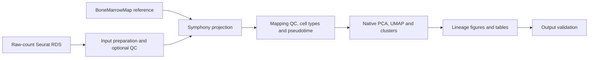
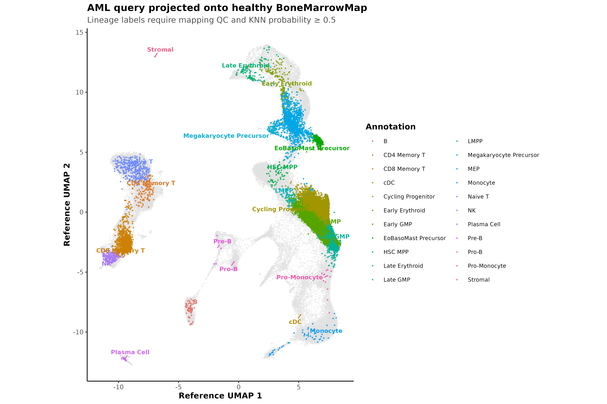
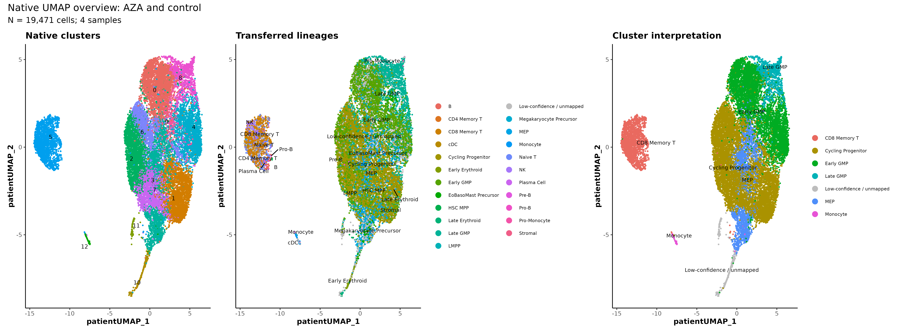
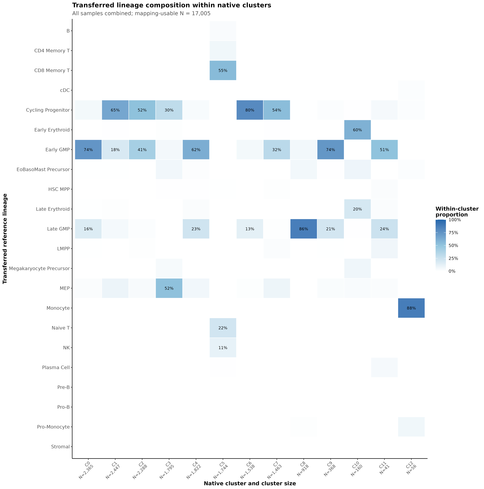

# Reference-guided scRNA-seq Leukemia Projection

A modular **Snakemake workflow** for projecting leukemia single-cell RNA-seq data onto the healthy **BoneMarrowMap** reference. Starting from raw-count Seurat objects, it produces reference annotations, mapping QC, hematopoietic pseudotime, native clusters, and publication figures in PDF and 400-dpi PNG formats.

This workflow refactors the supplied `aml_bonemarrowmap_pipeline_V2.R` analysis into twelve focused R sections. It retains the reference-mapping and lineage analysis while removing **all LSC/BLAST scoring, classification, enrichment, highlights, and related pseudobulk analyses**. Final annotations describe transferred major lineages; they do not establish whether a cell is malignant.



## Quick start

Clone the repository and install the environments following [INSTALL.md](INSTALL.md). Run commands from the repository root.

```bash
git clone https://github.com/dr-farhan/Reference-guided-scRNA-seq-Leukemia-Projection.git
cd Reference-guided-scRNA-seq-Leukemia-Projection

# Edit input_paths, sample_meta_column and output_dir for your data.
cp config/config.yaml config/my_dataset.yaml
snakemake --cores 4 --configfile config/my_dataset.yaml --dry-run
snakemake --cores 4 --configfile config/my_dataset.yaml --rerun-incomplete
```

The first run downloads the reference RDS and UMAP model into `resources/reference/`. Reference files and single-cell data are not bundled in Git. An existing reference cache can be selected with `reference_cache_dir`.

### Reproduce GSE145410

The example expects the original dataset directory beside this repository. It uses the **same input RDS and cached reference assets** as the supplied V2 launcher.

```bash
snakemake --cores 4 --configfile config/gse145410.yaml --dry-run
snakemake --cores 4 --configfile config/gse145410.yaml --rerun-incomplete
```

To use an existing R installation, create an untracked `config/local.yaml`:

```yaml
rscript: /absolute/path/to/Rscript
```

Append it to either command: `--configfile config/gse145410.yaml config/local.yaml`. This is how the local validation uses the original V2 R environment. The full run passed on 19,471 cells from four samples, producing 13 native clusters and 23 PDF/PNG figure pairs. All 36 retained per-cell columns matched V2 exactly, and all 11 unchanged PNGs were byte-identical. See the [validation report](validation/README.md).

## Inputs and parameters

Provide one RDS, several RDS files, or directories matching `input_pattern`. Each input must be a Seurat object with raw UMI counts in the `RNA` assay (or the configured source assay). Use human gene symbols compatible with the reference. The workflow begins with prepared count objects; FASTQ alignment and count generation are outside its scope.

`sample_meta_column` defaults to `sample_id`. If it is absent or set to `null`, the input filename supplies the sample identity, matching V2. Every cell receives a filename prefix to keep identifiers unique when merging inputs. Optional input QC is **off by default**, also matching V2.

| Setting | Default | Purpose |
| --- | --- | --- |
| `mapping_mad_threshold` | 2.5 | Per-sample mapping-error threshold |
| `knn_k` | 30 | Reference neighbors for label and pseudotime transfer |
| `knn_probability_cutoff` | 0.50 | Confidence required for usable lineage annotations |
| `native_npcs` | 30 | Maximum native principal components |
| `native_resolution` | 0.6 | Native graph clustering resolution |
| `native_umap_min_dist` | 0.30 | Native UMAP minimum distance |
| `seed` | 20260818 | Original V2 random seed |

Native analysis uses SCTransform with mitochondrial-percentage regression and the original log-normalization fallback. Native clusters are computed jointly across the input cells. Treatment panels subset this shared embedding. Treatment groups are inferred from `treatment`, `timepoint`, and sample labels using the original rules; inspect `.treatment_group` before interpreting cohort comparisons.

## Results

```text
results/GSE145410/
├── figures/                  # Paired PDF and PNG figures
├── tables/                   # Input QC, per-cell and cluster annotations
├── objects/                  # Annotated Seurat RDS
├── checkpoints/              # Native analysis state for restarting reports
├── logs/                     # One log per Snakemake rule
├── benchmarks/               # Runtime and resource measurements
├── provenance/               # Resolved config and figure checksums
├── validation/               # Machine-readable output checks
├── METHODS_AND_INTERPRETATION.txt
└── sessionInfo.txt
```

Figure numbering follows V2 so results can be compared directly. Figures 9 and 10 are deliberately absent. Figure 5 contains only pseudotime. Figures 3, 7, 8, 11, 12, and per-sample annotation panels use lineage-only annotations. See the complete [analysis and figure crosswalk](docs/analysis_crosswalk.md).

## GSE145410 example figures







## Workflow organization

The Snakefile exposes separate preparation, projection, native-analysis, reporting, and validation rules. Each analysis process reloads its explicit state and saved random-number state. Twelve numbered scripts in `workflow/scripts/` separate the scientific sections; `bootstrap.R`, `utils.R`, and `run_stage.R` provide configuration, helpers, and stage dispatch.

R uses readable assignments, `%>%` pipelines, named function arguments, and ggplot2 layers, informed by the teaching-oriented code in [Ming Tang's scclusteval](https://github.com/crazyhottommy/scclusteval) and [Snakemake workflow examples](https://github.com/crazyhottommy/pyflow-ChIPseq). The retained scientific implementation derives from the supplied V2 scripts; this project is not affiliated with those repositories.

## Running on LSF

Activate the workflow environment, create `config/local.yaml`, and submit from the repository root:

```bash
bsub < profiles/lsf/submit.lsf.sh
```

The launcher runs Snakemake within one four-core LSF allocation, following the original V2 resource request. Queue names and memory-limit semantics are site-specific; adapt the directives to your cluster. Local runs can use `snakemake --profile profiles/local`. The GSE145410 validation was run in an existing compute allocation with `--cores 1`.

## Validation and maintenance

```bash
python -m unittest discover -s tests -v
Rscript --vanilla -e 'for (f in list.files("workflow/scripts", pattern="[.]R$", full.names=TRUE)) parse(f)'

# Compare with an existing V2 analysis; does not rerun excluded analyses.
Rscript --vanilla tests/compare_v2.R \
  ../single_cell_dataset_GSE145410/Revised_V2 \
  results/GSE145410 validation/local

# Recheck figure integrity even when Snakemake has nothing to rerun.
python workflow/scripts/validate_outputs.py \
  results/GSE145410 results/GSE145410/validation/output_checks.json
```

The validator checks cell identity, cell-count conservation, paired figure formats, file signatures and checksums, and absence of excluded output annotations. Snakemake tracks the figure directory as a single output; use the integrity command above to detect deletion or modification of an individual image inside an otherwise existing directory.

## References

- Zeng AGX et al. *Blood Cancer Discovery* (2025), 6:307–324. [DOI: 10.1158/2643-3230.BCD-24-0342](https://doi.org/10.1158/2643-3230.BCD-24-0342).
- [BoneMarrowMap software and reference documentation](https://github.com/andygxzeng/BoneMarrowMap).
- [Snakemake documentation](https://snakemake.readthedocs.io/).
- [GSE145410 at GEO](https://www.ncbi.nlm.nih.gov/geo/query/acc.cgi?acc=GSE145410).

See [CITATION.cff](CITATION.cff) for the workflow citation and [LICENSE](LICENSE) for the code license. Reference assets and input datasets retain their own terms.
