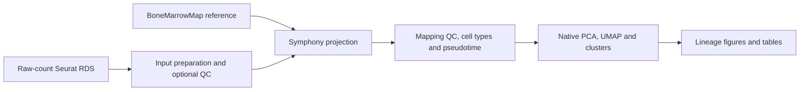

# Reference-guided scRNA-seq Leukemia Projection

A **Snakemake pipeline** for projecting leukemia single-cell RNA-seq data onto the healthy **BoneMarrowMap** reference. Starting from raw-count Seurat objects, it produces reference annotations, mapping QC, hematopoietic pseudotime, and native clusters.

This workflow perform the reference-mapping and lineage analysis and do reference guided lineage annotation. Final annotations describe transferred major lineages.



## Quick start

Clone the repository and install the environments following [INSTALL.md](INSTALL.md). Run commands from the repository root.

```bash
git clone https://github.com/dr-farhan/Reference-guided-scRNA-seq-Leukemia-Projection.git
cd Reference-guided-scRNA-seq-Leukemia-Projection

# Edit input_paths, sample_meta_column and output_dir for your data.
cp config/config.yaml config/my_dataset.yaml
snakemake --cores 4 --configfile config/my_dataset.yaml --dry-run
snakemake --cores 4 --configfile config/my_dataset.yaml --rerun-incomplete
```

Run the lightweight environment and file check before analysis:

```bash
snakemake preflight --cores 1 --configfile config/my_dataset.yaml config/local.yaml
```

Preflight checks that the configured `rscript` exists and is executable, all required R packages (including BoneMarrowMap and Symphony) load, and the resolved input RDS and both reference files exist and are readable.


## Inputs and parameters

Provide your query sc-RNA-seq data that you want to project as RDS object, several RDS files, or directories matching `input_pattern`. Each input must be a Seurat object with raw UMI counts in the `RNA` assay (or the configured source assay). Use human gene symbols compatible with the reference. 


| Setting | Default | Purpose |
| --- | --- | --- |
| `mapping_mad_threshold` | 2.5 | Per-sample mapping-error threshold |
| `knn_k` | 30 | Reference neighbors for label and pseudotime transfer |
| `knn_probability_cutoff` | 0.50 | Confidence required for usable lineage annotations |
| `native_npcs` | 30 | Maximum native principal components |
| `native_resolution` | 0.6 | Native graph clustering resolution |
| `native_umap_min_dist` | 0.30 | Native UMAP minimum distance |
| `seed` | 20260818 | Original V2 random seed |

Clustering (native) analysis uses SCTransform with mitochondrial-percentage regression and the original log-normalization fallback. Native clusters are computed jointly across the input cells. Treatment panels subset this shared embedding. Treatment groups are inferred from `treatment`, `timepoint`, and sample labels using the original rules; inspect `.treatment_group` before interpreting cohort comparisons.

## Results

```text
results/
├── figures/                  # Paired PDF and PNG figures
├── tables/                   # Input QC, per-cell and cluster annotations
├── objects/                  # Annotated Seurat RDS
├── checkpoints/              # Native analysis state for restarting reports
├── logs/                     # One log per Snakemake rule
├── benchmarks/               # Runtime and resource measurements
├── provenance/               # Resolved config and figure checksums
├── METHODS_AND_INTERPRETATION.txt
└── sessionInfo.txt
```

## Workflow organization

The Snakefile rules track their own R modules plus shared startup/utilities; edits to plotting modules (`05`–`11`) or table reporting (`12`) rerun reporting without rerunning upstream analysis or rewriting the annotated Seurat RDS. Changes to shared startup/utilities can still rerun all affected stages.

Reporting and `export_object` independently consume `checkpoints/03_native.rds`. The default target produces both, retaining the original output paths and uncompressed RDS format. To regenerate reports, use `snakemake figures_and_tables --cores 4 --configfile config/my_dataset.yaml --forcerun figures_and_tables`.


## References

- Zeng AGX et al. *Blood Cancer Discovery* (2025), 6:307–324. [DOI: 10.1158/2643-3230.BCD-24-0342](https://doi.org/10.1158/2643-3230.BCD-24-0342).
- [BoneMarrowMap software and reference documentation](https://github.com/andygxzeng/BoneMarrowMap).
- [Snakemake documentation](https://snakemake.readthedocs.io/).

See [CITATION.cff](CITATION.cff) for the workflow citation and [LICENSE](LICENSE) for the code license. Reference assets and input datasets retain their own terms.
